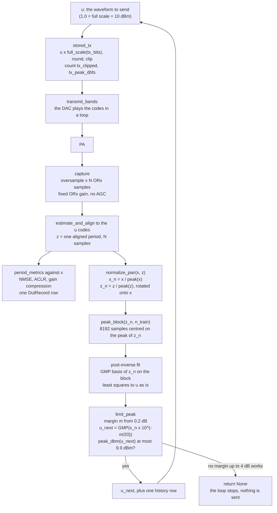

# One DPD pass

This page shows what happens in one pass of the live DPD loop, from the
captured signals to the next waveform the DAC plays. The loop is
`adrvtrx.linearize.linearize`. The pass is `adrvtrx.dpd.IlaStep`, an
indirect-learning (ILA) step with the built-in GMP (`adrvtrx.gmp.GMP`).
The whole notebook around it is in [linearize_notebook.md](linearize_notebook.md).

## Signals and units

| Symbol | What it is | Units |
|---|---|---|
| `x` | The original input, one period of N samples | Normalized: 1.0 = DAC full scale = the original input peak = **10 dBm** |
| `u` | The waveform transmitted in this iteration. Iteration 0 sends `x` | Same as `x` |
| `z` | The ORx capture of the PA output driven by `u`, aligned to `u` | ORx codes / `full_scale(rx_bits)`. Its scale depends on the ORx gain |
| `u_next` | The waveform for the next iteration | Same as `x` |

`peak_dbm(s) = 10 + 20·log10(max|s|)`. A waveform at full scale has a 10 dBm peak.
The default limit, 9.9 dBm, is a peak of 0.989 of full scale.

## The pass

## Stage by stage

| # | Stage | Input | Output | Units | Function |
|---|---|---|---|---|---|
| 1 | Scale to DAC codes | `u` | complex TX codes | codes, full scale `2**(tx_bits-1) - 1` (2047 at 12 bits) | `replay.stored_tx` |
| 2 | Transmit | TX codes | the DAC loops one period | — | `replay.transmit_stored` → `transmit_bands(..., do_normalize=False)` |
| 3 | Capture | — | `oversample·N` ORx samples, clip report | ORx codes | `conditions.capture_point` → `capture.capture`, `gain.clip_report` |
| 4 | Align | TX codes of `u`, the capture | `z`, N samples aligned to `u` | ORx codes (`linearize` divides by `full_scale(rx_bits)`) | `align.estimate_and_align` |
| 5 | Score | `x`, `z` | NMSE, ACLR lower/upper, gain compression, PAPR, ... | dB, dBc | `metrics.period_metrics` → `DutRecord` |
| 6 | Normalize | `x`, `z` | `x_n`, `z_n` | peak 1.0, loop phase removed | `dpd.normalize_pair` |
| 7 | Training block | `z_n` | `(start, stop)` | samples | `gmp.peak_block` |
| 8 | Post-inverse fit | `z_n` (input), `u` (target) | GMP coefficients | target in DAC units | `gmp.GMP.fit` |
| 9 | Predistort with the peak check | `x_n`, the post-inverse | `u_next`, margin, peak | DAC units, dB, dBm | `dpd.limit_peak` |
| 10 | Log | — | one row in `IlaStep.history` | — | `dpd.IlaStep` |

### 1–2. What is transmitted

`u` is multiplied by the TX full scale `2**(tx_bits-1) - 1`, rounded, and
clipped per rail (I and Q) to the signed range. Nothing rescales it: no peak
normalize and no power change. `tx_clipped` counts the samples whose I or Q
went past full scale before the clip. `tx_peak_dbfs` is the larger rail
before the clip.

Every DPD waveform has `max|u| ≤ 0.989` (9.9 dBm), so neither rail can pass
full scale and `tx_clipped` is 0.

### 3–4. Capture and alignment

The capture holds `oversample` periods (2 by default), so one whole period can
be cut out wherever the capture started. The ORx gain and the TX attenuation
are the saved condition. They do not change during the loop, so the
iterations are comparable.

`z` is aligned to `u`, the waveform the DAC played, not to `x`. A delay that a
model adds stays in `z` and counts as error against `x`.

### 5. Score

`z` is scored against `x`: NMSE after one least-squares gain, ACLR of `z`
alone (one Hann-windowed FFT, channels `[-bw/2, bw/2)`, `[-1.5bw, -0.5bw)`,
`[0.5bw, 1.5bw)`), and the gain compression left at the peaks. Definitions:
[dpd_workflow_spec.md §3](dpd_workflow_spec.md#3-metrics).

### 6. Normalize (`normalize_pair`)

`x_n = x / max|x|` and `z_n = z / max|z|`, then `z_n` is multiplied by
`exp(-j·angle(vdot(x_n, z_n)))`. This removes the loop gain and phase. Every
DPD path normalizes the same way through this one function.

### 7. Training block (`peak_block`)

`n_train` samples (8192 by default) centred on the peak of `z_n`, clamped
inside the period. The block holds the strongest compression, so the fit
covers the whole amplitude range. The whole period is used when `n_train` is
at least its length.

### 8. Post-inverse fit (GMP, block least squares)

The post-inverse maps the normalized output `z_n` back to the waveform that
produced it, `u`.

- **Basis.** `GMP(K, N, M)`, the same basis and coefficient count as dpd_kit
  `GMP.unified(K, N, M)`: `N·(K·(1+2M)+1)` complex coefficients (130 for the
  default 5, 5, 2).
  - aligned `z(n-l)·|z(n-l)|^k`, k = 0..K, l = 0..N-1
  - lagging `z(n-l)·|z(n-l-m)|^k`, k = 1..K, m = 1..M
  - leading `z(n-l)·|z(n-l+m)|^k`, k = 1..K, m = 1..M (reads up to M future
    samples; `causal=True` drops those terms)
  - samples outside the period read as zero.
- **Target.** `u` **as is**, in DAC units, not normalized. So the model output
  is in DAC units, and the peak check in step 9 is a real DAC peak.
- **Solve.** Plain least squares on the block rows. Each basis column is
  divided by its norm before the solve (the powers of `|z|` differ by orders of
  magnitude), and the coefficients are scaled back after it. This only helps
  the conditioning; the answer is the plain least-squares one. `ridge > 0`
  adds a ridge term on the scaled columns (off by default).
- **Check.** `post_inverse_nmse_db` is the fit error over the whole period,
  `10·log10(Σ|u - GMP(z_n)|² / Σ|u|²)`, with no gain removed.

### 9. Predistort with the auto margin and the peak check (`limit_peak`)

`u_next = GMP(x_n · 10^(-m/20))`. `m` is the input backoff (the margin).

- Start at `m = 0.2 dB` (`PEAK_MARGIN_DB`). If `peak_dbm(u_next) ≤ 9.9 dBm`,
  that is the answer.
- Otherwise try `m` in 0.25 dB steps up to 4.0 dB (`MAX_MARGIN_DB`). The DPD
  peak need not fall smoothly with `m`, so no shape is assumed.
- In the first step that meets the limit, bisect against the step before it
  down to 0.01 dB. The returned margin is one that was computed and met the
  limit.
- If no margin up to 4.0 dB meets the limit, the pass returns `None`. The loop
  stops and that waveform is never transmitted. `IlaStep.reason` says why.

What the margin means: `x_n` has a unit peak, and the post-inverse was trained
on a `z_n` whose unit peak is the output peak just measured. So the next
waveform aims for an output peak `m` dB below the last one. The PA output
peak, and the drive, step down by about the margin on every pass (about
0.2–0.3 dB per pass in the offline runs).

### 10. What is logged

| Where | What |
|---|---|
| `IlaStep.history` (one dict per pass) | `iteration` (the iteration that sends `u_next`), `post_inverse_nmse_db`, `margin_db`, `dpd_peak_dbm`, `papr_expansion_db` (`papr(u_next) - papr(x)`), `ok` |
| `LinearizeResult.records` (one `DutRecord` per capture) | NMSE, ACLR lower/upper, gain compression, PAPR in/out/expansion, ORx peak and railed samples, `tx_peak_dbfs`, `tx_clipped` |
| `save_dir` (when set) | `{name}_{label}_it{k}_u.txt`, `{name}_{label}_it{k}_z.txt`, `{label}.csv` (DUT columns plus `iteration`) |
| the notebook | `{label}_steps.csv` = `dpd.iteration_table(records, history)`: one row per capture with ACLR lower/upper/worst, NMSE, gain compression, margin, DPD peak, PAPR expansion, `tx_clipped` |

## What to expect (offline)

Full TX1 2.4 GHz / 100 MHz capture (983 040 samples), with a GMP(5, 5, 2)
forward model of the PA as the device and `GMP(5, 5, 2)` as the post-inverse:

| Iteration | NMSE (dB) | ACLR lower / upper (dBc) | Margin (dB) | DPD peak (dBm) | PAPR expansion (dB) |
|---|---|---|---|---|---|
| 0 (no DPD) | -17.5 | -26.8 / -26.4 | — | 10.00 | 0.00 |
| 1 | -43.9 | -50.0 / -51.6 | 0.20 | 9.09 | 2.99 |
| 2 | -48.7 | -57.1 / -56.5 | 0.20 | 8.70 | 2.75 |
| 3 | -49.9 | -58.0 / -57.6 | 0.20 | 8.36 | 2.64 |

The forward model has no noise, so these are better than a bench will give.
They show the shape: most of the gain in the first pass, smaller gains after,
and the DPD peak stepping down with the output peak.
