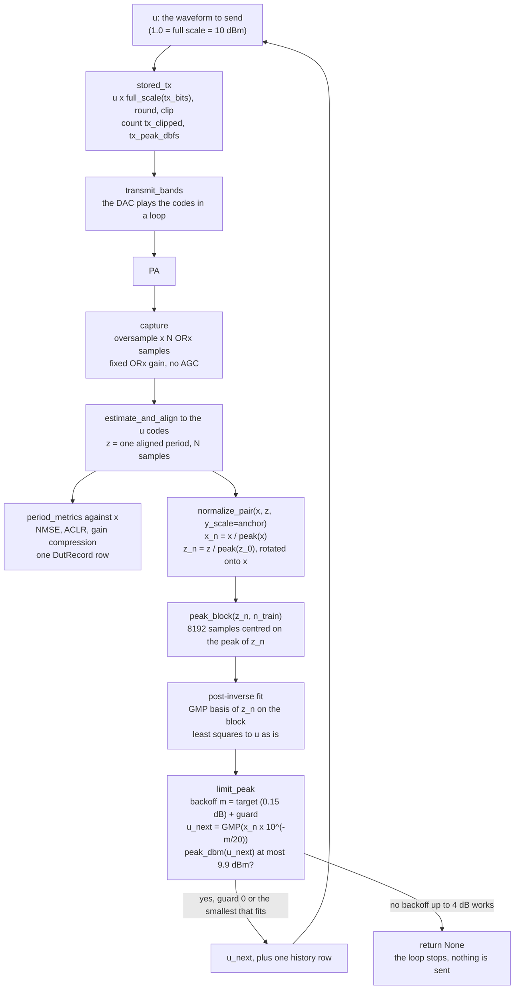

# One DPD pass

This page shows what happens in one pass of the live DPD loop, from the
captured signals to the next waveform the DAC plays. The loop is
`adrvtrx.linearize.linearize`. The pass is `adrvtrx.dpd.IlaStep`, an
indirect-learning (ILA) step with the built-in GMP (`adrvtrx.gmp.GMP`).
The whole notebook around it is in [linearize_notebook.md](linearize_notebook.md).

## Signals and units

| Symbol | What it is | Units |
|---|---|---|
| `x` | The original input, one period of N samples | Normalized: 1.0 = DAC full scale = the original input peak = **10 dBm** |
| `u` | The waveform transmitted in this iteration. Iteration 0 sends `x` | Same as `x` |
| `z` | The ORx capture of the PA output driven by `u`, aligned to `u` | ORx codes / `full_scale(rx_bits)`. Its scale depends on the ORx gain, which stays fixed for the whole loop |
| `z_0` | The capture of iteration 0 (no DPD, `u = x`) | Same as `z`. Its peak is the **anchor** |
| `u_next` | The waveform for the next iteration | Same as `x` |

`peak_dbm(s) = 10 + 20·log10(max|s|)`. A waveform at full scale has a 10 dBm peak.
The default limit, 9.9 dBm, is a peak of 0.989 of full scale.

## The pass

## Stage by stage

| # | Stage | Input | Output | Units | Function |
|---|---|---|---|---|---|
| 1 | Scale to DAC codes | `u` | complex TX codes | codes, full scale `2**(tx_bits-1) - 1` (2047 at 12 bits) | `replay.stored_tx` |
| 2 | Transmit | TX codes | the DAC loops one period | — | `replay.transmit_stored` → `transmit_bands(..., do_normalize=False)` |
| 3 | Capture | — | `oversample·N` ORx samples, clip report | ORx codes | `conditions.capture_point` → `capture.capture`, `gain.clip_report` |
| 4 | Align | TX codes of `u`, the capture | `z`, N samples aligned to `u` | ORx codes (`linearize` divides by `full_scale(rx_bits)`) | `align.estimate_and_align` |
| 5 | Score | `x`, `z` | NMSE, ACLR lower/upper, gain compression, PAPR, ... | dB, dBc | `metrics.period_metrics` → `DutRecord` |
| 6 | Normalize | `x`, `z`, the anchor | `x_n`, `z_n` | `x_n` peak 1.0; `z_n` relative to the iteration-0 peak; loop phase removed | `dpd.normalize_pair` |
| 7 | Training block | `z_n` | `(start, stop)` | samples | `gmp.peak_block` |
| 8 | Post-inverse fit | `z_n` (input), `u` (target) | GMP coefficients | target in DAC units | `gmp.GMP.fit` |
| 9 | Predistort at the target, with the peak check | `x_n`, the post-inverse | `u_next`, target + guard backoff, peak | DAC units, dB, dBm | `dpd.limit_peak` |
| 10 | Log | — | one row in `IlaStep.history` | — | `dpd.IlaStep` |

### 1–2. What is transmitted

`u` is multiplied by the TX full scale `2**(tx_bits-1) - 1`, rounded, and
clipped per rail (I and Q) to the signed range. Nothing rescales it: no peak
normalize and no power change. `tx_clipped` counts the samples whose I or Q
went past full scale before the clip. `tx_peak_dbfs` is the larger rail
before the clip.

Every DPD waveform has `max|u| ≤ 0.989` (9.9 dBm), so neither rail can pass
full scale and `tx_clipped` is 0.

### 3–4. Capture and alignment

The capture holds `oversample` periods (2 by default), so one whole period can
be cut out wherever the capture started. The ORx gain and the TX attenuation
are the saved condition. They do not change during the loop, so the
iterations are comparable.

`z` is aligned to `u`, the waveform the DAC played, not to `x`. A delay that a
model adds stays in `z` and counts as error against `x`.

### 5. Score

`z` is scored against `x`: NMSE after one least-squares gain, ACLR of `z`
alone (one Hann-windowed FFT, channels `[-bw/2, bw/2)`, `[-1.5bw, -0.5bw)`,
`[0.5bw, 1.5bw)`), and the gain compression left at the peaks. Definitions:
[dpd_workflow_spec.md §3](dpd_workflow_spec.md#3-metrics).

### 6. Normalize against the anchor (`normalize_pair`)

`x_n = x / max|x|`. The capture is divided by the **anchor**, the peak of the
iteration-0 capture `z_0` (the PA without DPD): `z_n = z / max|z_0|`. Then `z_n`
is multiplied by `exp(-j·angle(vdot(x_n, z_n)))` to remove the loop phase. The
first call of a run (`it == 0`) takes the anchor; every later capture uses the
same one. The ORx gain is fixed during the loop, so `z_n` shows the real output
level of each pass: `history["z_peak_db"]` is `20·log10(max|z| / anchor)`.

Why an anchor. If each capture were divided by its own peak (the first
version, still available as `anchor="each"`), every pass would aim a little
below the output it had just reached, and the target would slide down by the
backoff on every pass. Over five passes at 0.2 dB that cost 1.1 dB of output
peak and 1.8 dB of DPD peak (table below). With the anchor the target is fixed.

Every DPD path normalizes through this one function.

### 7. Training block (`peak_block`)

`n_train` samples (8192 by default) centred on the peak of `z_n`, clamped
inside the period. The block holds the strongest compression, so the fit
covers the whole amplitude range. The whole period is used when `n_train` is
at least its length.

### 8. Post-inverse fit (GMP, block least squares)

The post-inverse maps the normalized output `z_n` back to the waveform that
produced it, `u`.

- **Basis.** `GMP(K, N, M)`, the same basis and coefficient count as dpd_kit
  `GMP.unified(K, N, M)`: `N·(K·(1+2M)+1)` complex coefficients (130 for the
  default 5, 5, 2).
  - aligned `z(n-l)·|z(n-l)|^k`, k = 0..K, l = 0..N-1
  - lagging `z(n-l)·|z(n-l-m)|^k`, k = 1..K, m = 1..M
  - leading `z(n-l)·|z(n-l+m)|^k`, k = 1..K, m = 1..M (reads up to M future
    samples; `causal=True` drops those terms)
  - samples outside the period read as zero.
- **Target.** `u` **as is**, in DAC units, not normalized. So the model output
  is in DAC units, and the peak check in step 9 is a real DAC peak.
- **Solve.** Plain least squares on the block rows. Each basis column is
  divided by its norm before the solve (the powers of `|z|` differ by orders of
  magnitude), and the coefficients are scaled back after it. This only helps
  the conditioning; the answer is the plain least-squares one. `ridge > 0`
  adds a ridge term on the scaled columns (off by default).
- **Check.** `post_inverse_nmse_db` is the fit error over the whole period,
  `10·log10(Σ|u - GMP(z_n)|² / Σ|u|²)`, with no gain removed.

### 9. Predistort at the target, with the peak check (`limit_peak`)

`u_next = GMP(x_n · 10^(-m/20))`, where `m` is the input backoff, in two parts:

- **Target backoff** (`TARGET_BACKOFF_DB`, default 0.15 dB). This rule is set
  once: the output peak should sit 0.15 dB below the iteration-0 output peak.
  Because `z_n` is on the anchor scale, `x_n · 10^(-0.15/20)` asks for exactly
  that. The small backoff keeps the request inside what the post-inverse was
  trained on (the top of `z_n`) and off the flattest part of the PA, where the
  inverse is steepest. It is the same on every pass and does not grow.
- **Guard** (only if needed). If the DPD peak at the target would be above
  9.9 dBm (`PEAK_LIMIT_DBM`), the backoff goes up from the target in 0.25 dB
  steps, up to 4.0 dB in total (`MAX_MARGIN_DB`). The DPD peak need not fall
  smoothly with `m`, so no shape is assumed. In the first step that meets the
  limit, bisection against the step before it finds the smallest guard to
  0.01 dB. The guard is worked out again on each pass from the target, so it
  never accumulates. `history` reports `target_backoff_db` and `guard_db`
  separately, and `margin_db` is their sum.
- If no backoff up to 4.0 dB meets the limit, the pass returns `None`. The loop
  stops and that waveform is never transmitted. `IlaStep.reason` says why.

**Why a little output target costs a lot of drive.** Near its peak the PA's
AM/AM is nearly flat. The measured top slope (`d|out|/d|in|` with the
small-signal gain divided out, 0.8–0.95 of the peak) is 0.21 on the 2.4 GHz /
100 MHz capture (0.19 on its model). So moving the output peak needs several
times as much input. On the PA model driven by `x` without DPD, backing the
input off by 1 dB lowers the output peak by only 0.19 dB, and backing off by
0.5 dB lowers it by 0.04 dB. That is about 0.5 dB of drive per 0.1 dB of output,
and more at the very top. With the DPD running, the transmitted peak moved
about 0.2 dB per 0.1 dB of target (full-length model, 9.39 → 9.21 dBm from a
0 to a 0.1 dB target), 0.24 dB on the fixture and 0.3 dB on the sim bench. So the
old 0.2 dB per pass slide wasted drive fast. That is why the backoff is a fixed
target plus a check.

**The DPD's PAPR expansion is about the PA's PAPR compression.** With the
output peak held near the no-DPD peak, the linearized output gets back the
input's PAPR. Its RMS falls by about the PA's PAPR compression, and the DPD
input follows. Measured on the full-length 2.4 GHz / 100 MHz model after 5
passes: expansion 3.04 / 3.01 / 2.98 / 2.95 / 2.92 dB for targets 0 / 0.05 /
0.1 / 0.15 / 0.2 dB. The PA's PAPR compression without DPD is 3.05 dB on the
model and 3.06 dB on the capture. Its peak gain compression is 4.53 dB on the
model and 4.40 dB on the capture. So the expansion follows the PAPR
compression (within 0.15 dB), not the gain compression. Whatever the expansion,
the DPD peak stays at or below 9.9 dBm.

### 10. What is logged

| Where | What |
|---|---|
| `IlaStep.history` (one dict per pass) | `iteration` (the iteration that sends `u_next`), `z_peak_db` (the capture's peak relative to the anchor), `post_inverse_nmse_db`, `target_backoff_db`, `guard_db`, `margin_db` (their sum), `dpd_peak_dbm`, `papr_expansion_db` (`papr(u_next) - papr(x)`), `ok` |
| `LinearizeResult.records` (one `DutRecord` per capture) | NMSE, ACLR lower/upper, gain compression, PAPR in/out/expansion, ORx peak and railed samples, `tx_peak_dbfs`, `tx_clipped` |
| `save_dir` (when set) | `{name}_{label}_it{k}_u.txt`, `{name}_{label}_it{k}_z.txt`, `{label}.csv` (DUT columns plus `iteration`) |
| the notebook | `{label}_steps.csv` = `dpd.iteration_table(records, history)`: one row per capture with ACLR lower/upper/worst, NMSE, `output_peak_db` (vs iteration 0, from `rms_dbfs + papr_out_db`), gain and PAPR compression (`x → z`), `pa_papr_compression_db` (`papr(u) − papr(z)`), PAPR expansion, DPD peak, target and guard backoff, `tx_clipped` |

## What to expect (offline)

Full TX1 2.4 GHz / 100 MHz capture (983 040 samples). The device is a GMP(5, 5, 2)
forward model of the PA; the post-inverse is `GMP(5, 5, 2)`; the target is 0.15 dB;
6 captures. Output peak is relative to iteration 0. Compression columns are
`x → z`.

| Iteration | NMSE (dB) | ACLR lower / upper (dBc) | Output peak (dB) | DPD peak (dBm) | PAPR expansion (dB) | PAPR comp. (dB) | Gain comp. (dB) |
|---|---|---|---|---|---|---|---|
| 0 (no DPD) | -17.5 | -26.8 / -26.4 | 0.00 | 10.00 | 0.00 | 3.05 | 4.53 |
| 1 | -43.7 | -49.8 / -51.4 | -0.05 | 9.23 | 3.07 | -0.10 | 0.01 |
| 2 | -47.8 | -55.8 / -56.1 | -0.09 | 9.06 | 2.90 | -0.06 | 0.02 |
| 3 | -48.1 | -55.7 / -56.0 | -0.12 | 9.10 | 2.94 | -0.03 | 0.03 |
| 4 | -48.0 | -55.6 / -56.3 | -0.11 | 9.10 | 2.94 | -0.04 | 0.03 |
| 5 | -47.9 | -55.3 / -56.3 | -0.08 | 9.11 | 2.95 | -0.07 | 0.03 |

The guard never engaged (the DPD peak stayed at or below 9.23 dBm). The output
peak stays within 0.12 dB of iteration 0 and within 0.1 dB of the target. With
the old sliding target (0.2 dB per pass) the output peak fell to -1.13 dB and the
DPD peak to 7.25 dBm after 5 passes. ACLR was better there (-59.5 / -60.0 dBc),
but only because the PA was driven 1.1 dB softer.

**Target sweep** (same device, 6 captures, last capture). The default is the
smallest target whose final worst ACLR is within 0.5 dB of the best: 0.15 dB.

| Target (dB) | ACLR lower / upper (dBc) | NMSE (dB) | Output peak, it 1–5 (dB) | DPD peak (dBm) | PAPR expansion (dB) | Guard (dB) |
|---|---|---|---|---|---|---|
| 0 | -54.3 / -55.7 | -47.1 | +0.08 … +0.15 | 9.39 | 3.04 | 0 |
| 0.05 | -54.7 / -55.9 | -47.4 | +0.01 … +0.08 | 9.30 | 3.01 | 0 |
| 0.10 | -55.0 / -56.1 | -47.6 | -0.06 … +0.02 | 9.21 | 2.98 | 0 |
| **0.15** | -55.3 / -56.3 | -47.9 | -0.12 … -0.05 | 9.11 | 2.95 | 0 |
| 0.20 | -55.6 / -56.6 | -48.2 | -0.19 … -0.12 | 9.01 | 2.92 | 0 |
| 0.20, old sliding target | -59.5 / -60.0 | -52.0 | -1.13 … -0.12 | 7.25 | 2.20 | 0 |

On this model the output peak overshoots small targets by up to 0.15 dB. The
largest residual error over a million samples lands on the top, so the measured
peak reads high. It does not drift: across passes 1–5 it stays in a 0.08 dB
band for every target.

**After convergence.** With a fixed target the worst ACLR is best after pass 2
or 3. After that it slowly gets worse, by up to 0.4 dB per pass on this model
(for example -55.8, -55.7, -55.6, -55.3 dBc at 0.15 dB). The sim bench with
GMP(5, 5, 2) shows the same shape, more strongly: 0.4 dB at pass 3 with the
sim's noise, and 0.6–2.1 dB per pass after pass 3 without noise. There the
output also stays about 0.1 dB short of the target. A memoryless GMP(9, 1, 0)
reaches the target there and holds ACLR.
Damping the update (0.5 or 0.7) or a ridge term only moved the best pass, so
neither is used. The old sliding target hid this by lowering the drive on every
pass. The notebook's default `N_ITER = 4` (3 passes) stops near the best pass.
If more passes are needed, watch the ACLR column and keep the best waveform
(every `u` is saved).

The forward model has no noise, so these figures are better than a bench will
give.
