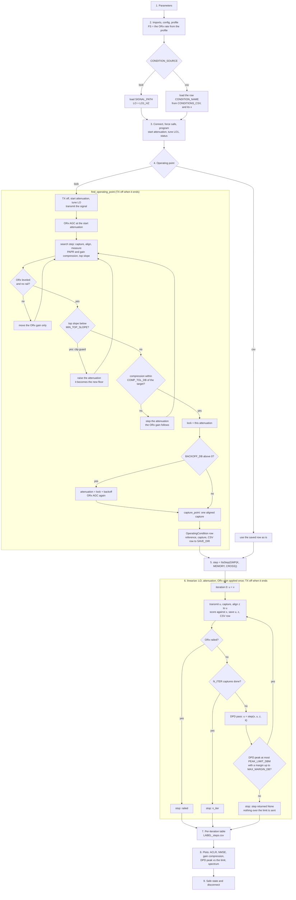

# The live DPD notebook (`notebooks/dpd_linearize_loop.ipynb`)

One notebook takes the PA from "find the operating point" to "linearized". It
runs on the Windows control PC with the ADS9 + ADRV9026 connected. TX1 drives
the PA and ORx1 observes it, on LO1. What happens inside one DPD pass is in
[dpd_pass.md](dpd_pass.md).

## The flow

## Step by step

1. **Parameters.** Every setting is in the first cell (table below).
2. **Imports, config, profile.** `FS` is the ORx rate read from the profile.
   With `"lock"` the signal file is loaded. With `"csv"` the saved row and its
   reference `x` are loaded from the capture CSV. Nothing is transmitted yet.
3. **Connect and program.** `Radio.connect`, `force_safe`, `program`. TX1 is
   set to the start attenuation (`"lock"`) or the saved attenuation (`"csv"`),
   LO1 is tuned, and the status is printed.
4. **Operating point.**
   - `"lock"`: `adrvtrx.operating_point.find_operating_point` does what
     `pa_operating_point.ipynb` does, in one call:
     1. TX off, start attenuation, LO tuned, then the signal is transmitted
        (normalized and quantized).
     2. The ORx AGC levels the capture at the start attenuation.
     3. The search (`find_compression_point`) captures, aligns, and measures
        the PAPR compression on a `WINDOW_MS` window around the peak, the gain
        compression at the peaks, and the AM/AM top slope. A reading counts
        only when the ORx peak is in the AGC band with no railed sample;
        otherwise only the ORx gain moves. The attenuation steps down
        (`COARSE_STEP_DB` first, then multiples of `FINE_STEP_DB`) until the
        `LOCK_ON` compression is within `COMP_TOL_DB` of the target. It never
        goes below `TX_ATTEN_MIN_DB`.
     4. **Clip guard** (`MIN_TOP_SLOPE` set): a trusted reading with a top
        slope below it means the PA output is flat at the peaks. The
        attenuation goes back up and that becomes the new floor. If the target
        needs more drive than that, the search stops at the last unclipped
        attenuation (`clip_limited`).
     5. **Backoff** (`BACKOFF_DB > 0`): the attenuation goes to
        `lock + BACKOFF_DB` and the ORx AGC runs again there.
     6. `capture_point` takes one aligned capture and scores it against the
        reference.
     7. The `OperatingCondition` row is built (name
        `{TX}_{backoff}dB_{freq_MHz}MHz_{bw}BW`). The reference, the capture and
        the row (appended to `{TX}_conditions.csv`) go to `SAVE_DIR`.
     8. TX is turned off, whatever happened. A fatal search (the ORx clips at
        the lowest gain) stops the notebook here. A search that did not
        converge prints a warning and the loop runs where it stopped.
   - `"csv"`: the saved row is used as it is. No search and no AGC.
5. **The DPD step.** `IlaStep(lambda: GMP(K, MEMORY, CROSS), ...)`. A fresh GMP
   is fitted on every pass.
6. **The loop.** `linearize` applies the condition once: LO1, the TX
   attenuation and the ORx gain. The ORx AGC does not run again, so the
   iterations are comparable. Iteration 0 transmits `x` (no DPD). Each
   iteration transmits `u`, captures `z`, aligns `z` to `u`, scores it against
   `x`, and saves `u`, `z` and one CSV row. Then the DPD pass makes the next
   `u`. It stops when:
   - `N_ITER` captures are done (`n_iter`);
   - the ORx rails (`railed`; the gain is not re-levelled during the loop);
   - no margin up to `MAX_MARGIN_DB` keeps the DPD peak at or below
     `PEAK_LIMIT_DBM` (`step returned None`). That waveform is never sent.

   TX is turned off when the loop ends, whatever happened.
7. **Per-iteration table.** One row per capture: ACLR lower, upper and worst,
   NMSE, gain compression, margin, DPD peak, PAPR expansion, `tx_clipped`, and
   the post-inverse fit error. Written to `{SAVE_DIR}/{LABEL}_steps.csv`.
8. **Plots.** ACLR lower and upper per iteration (with the worst value
   labelled), NMSE, gain compression, the transmitted peak against the limit
   (with the margin used), and the spectrum of `x`, iteration 0 and the last
   iteration, with the adjacent channels shaded.
9. **Safe state and disconnect.**

## Parameters

| Parameter | Default | Meaning |
|---|---|---|
| `PROFILE` | `ADRV9025Init_StdUseCase98_LinkSharing.profile` | Device profile. `FS` and the bit depths come from it |
| `TX_CHANNEL`, `ORX_CHANNEL` | `TX1`, `ORX1` | The PA path and the receiver that observes it |
| `CONDITION_SOURCE` | `"lock"` | `"lock"`: find the operating point here. `"csv"`: reuse a saved row |
| `CONDITIONS_CSV` | `captures/operating_sweep/TX1_conditions.csv` | `"csv"` only: the capture CSV |
| `CONDITION_NAME` | `TX1_0dB_2200MHz_100BW` | `"csv"` only: the row to use |
| `SIGNAL_PATH` | `new100MHz256QAM_CFRed.txt` | `"lock"` only: the signal, tab-separated I Q |
| `BW_MHZ` | `100` | `"lock"` only: the signal bandwidth, for ACLR |
| `LO1_HZ` | `2_400_000_000` | `"lock"` only: the LO |
| `LOCK_ON` | `"papr"` | What the search locks on: `"papr"` (PAPR compression on the peak window) or `"gain"` (gain compression at the peaks) |
| `TARGET_COMPRESSION_DB` | `3.0` | The compression to lock on (for example 4.0 with `"gain"`) |
| `COMP_TOL_DB` | `0.1` | Accept the lock within this many dB of the target (0.2 is typical with `"gain"`) |
| `WINDOW_MS` | `0.1` | Peak window for the PAPR compression |
| `MIN_TOP_SLOPE` | `None` | Clip guard: back off when the AM/AM top slope falls below this (for example 0.08). `None` = off |
| `TX_ATTEN_START_DB` | `20.0` | Safe start attenuation (more attenuation = less power) |
| `TX_ATTEN_MIN_DB` | `9.0` | The lowest attenuation the search may set |
| `COARSE_STEP_DB` | `5.0` | First attenuation step down |
| `FINE_STEP_DB` | `0.2` | Later steps are multiples of this |
| `ORX_TARGET_DBFS` | `-1.0` | ORx AGC target peak |
| `ORX_TOL_UP_DB`, `ORX_TOL_DOWN_DB` | `0.3`, `0.6` | ORx AGC band around the target |
| `BACKOFF_DB` | `0` | Attenuation above the lock for the loop. Above 0 the ORx AGC runs again |
| `N_ITER` | `4` | Captures, including iteration 0 (no DPD): 3 DPD passes |
| `K`, `MEMORY`, `CROSS` | `5`, `5`, `2` | GMP nonlinear order, memory depth, cross-term memory (130 coefficients) |
| `N_TRAIN` | `8192` | Post-inverse training block, centred on the peak of `z` |
| `PEAK_LIMIT_DBM` | `9.9` | Hard limit on the transmitted DPD peak. Full scale = the original input peak = 10 dBm |
| `PEAK_MARGIN_DB` | `0.2` | First input backoff the auto margin tries |
| `MAX_MARGIN_DB` | `4.0` | Largest input backoff. If even this exceeds the limit, the loop stops |
| `SAVE_DIR` | `DPD_DUT/ila_gmp` | Where every file of the run goes |
| `LABEL` | `ila_gmp` | Prefix of the loop files |
| `OUTPUT_OVERSAMPLE` | `2` | Periods per capture, so one aligned period can be cut out |

## Files

All in `SAVE_DIR`.

| File | Written by | What |
|---|---|---|
| `{signal_stem}_in.txt` | operating point (`"lock"`) | The reference `x`, normalized `I<TAB>Q` |
| `{name}_out.txt` | operating point (`"lock"`) | The aligned capture at the operating point |
| `{TX}_conditions.csv` | operating point (`"lock"`) | One `OperatingCondition` row per run, appended ([spec §4.1](dpd_workflow_spec.md#41-capture-csv-tx_conditionscsv)) |
| `{name}_{LABEL}_it{k}_u.txt` | `linearize` | The waveform sent at iteration `k` |
| `{name}_{LABEL}_it{k}_z.txt` | `linearize` | Its aligned capture |
| `{LABEL}.csv` | `linearize` | One DUT row per iteration plus `iteration` ([spec §4.2](dpd_workflow_spec.md#42-dut-csv-labelcsv)) |
| `{LABEL}_steps.csv` | the notebook | The per-iteration table |

## Trying it without the radio

`tests/test_notebook_linearize.py` runs the notebook's code cells against the
simulated bench (`tests/sim_bench.py`) with `"lock"` (PAPR lock, and gain lock
with `MIN_TOP_SLOPE = 0.08`) and with `"csv"`. It needs matplotlib.
